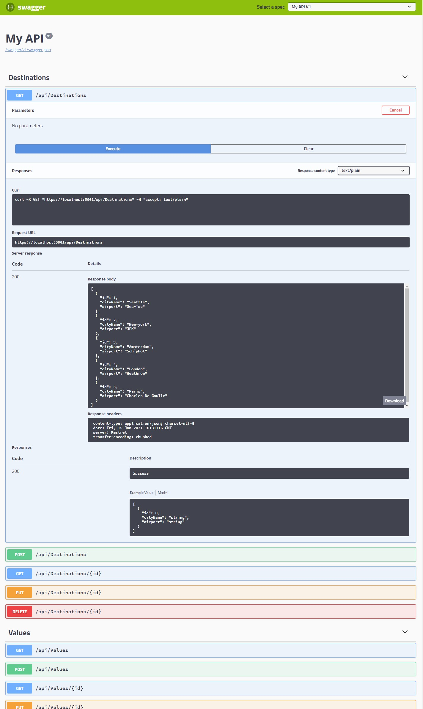

# Lesson 5: Automatically Generating HTTP Requests and Responses

### Demonstration: Testing HTTP requests with Swagger

- Abrimos el proyecto TestingHttpWithSwagger en Visual Studio Code 

- Configuramos el middleware para que acepte swagger

- Ejecutamos 

- Abrimos el navegador con la siguiente url

  

  ```url
  https://localhost:5001
  ```

  



